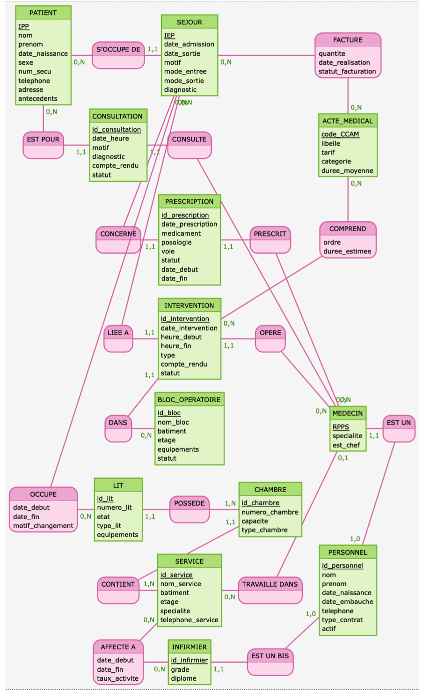

# Rapport de Projet - Base de Données Hospitalière
## Modélisation MERISE : MCD, MLD et implémentation SQL

**Réalisé par :** Cheriet Abdel  
**Formation :** Master 1 Statistique - Université de Strasbourg  
**Date de rendu :** 19 décembre 2025  
**Matière :** Bases de Données

---

## Introduction

Dans le cadre de ce projet, j'ai dû concevoir une base de données pour gérer un hôpital. L'objectif était de partir d'un cahier des charges et d'arriver à une base fonctionnelle en passant par toutes les étapes de la méthode MERISE.

J'ai choisi de modéliser un système qui gère les patients, le personnel (médecins et infirmiers), les séjours hospitaliers, les consultations et la facturation des actes médicaux. C'est un cas assez complet qui m'a permis de travailler sur plusieurs concepts comme l'héritage et les associations multiples.

---

## Partie 1 : Analyse du sujet

### Ce qu'il fallait gérer

Après lecture de l'énoncé, j'ai identifié les principales fonctionnalités à implémenter :

- La gestion des patients avec leurs informations personnelles et médicales
- Le personnel de l'hôpital, sachant qu'un employé peut être médecin ou infirmier mais pas les deux
- Les services hospitaliers avec leurs chambres et leurs lits
- Le suivi des séjours (qui est hospitalisé où et quand)
- Les consultations et prescriptions
- Les interventions chirurgicales au bloc opératoire
- La facturation des actes réalisés

### Les règles métier importantes

J'ai noté plusieurs contraintes à respecter :

1. Chaque patient a un identifiant unique appelé IPP (Identifiant Permanent Patient)
2. Les séjours sont identifiés par un IEP (Identifiant Épisode Patient)
3. Les médecins ont un numéro RPPS à 11 chiffres
4. Un lit ne peut pas être occupé par deux patients en même temps
5. Un membre du personnel est soit médecin soit infirmier, jamais les deux
6. Chaque service peut avoir un chef de service (un médecin)

---

## Partie 2 : Le Modèle Conceptuel de Données

### Diagramme MCD



### Les entités que j'ai identifiées

Au total, j'ai créé 13 entités. Voici les principales :

**PATIENT** - Pour stocker les infos des patients
- IPP (clé primaire)
- nom, prénom, date de naissance
- numéro de sécu (unique)
- téléphone, adresse
- antécédents médicaux

**PERSONNEL** - L'entité mère pour tous les employés
- id_personnel (clé primaire auto-incrémentée)
- nom, prénom
- date d'embauche
- type de contrat (CDI, CDD, Intérim)

**MEDECIN** - Hérite de PERSONNEL
- RPPS (clé primaire)
- spécialité médicale
- lien vers le service principal

**INFIRMIER** - Hérite aussi de PERSONNEL
- id_infirmier
- grade (IDE, IBODE, IADE)

Pour la partie infrastructure, j'ai :
- **SERVICE** : les différents services de l'hôpital
- **CHAMBRE** : les chambres de chaque service
- **LIT** : les lits dans chaque chambre
- **BLOC_OPERATOIRE** : pour les interventions

Et pour l'activité médicale :
- **SEJOUR** : quand un patient est hospitalisé
- **CONSULTATION** : les rendez-vous médicaux
- **PRESCRIPTION** : les médicaments prescrits
- **INTERVENTION** : les opérations chirurgicales
- **ACTE_MEDICAL** : le catalogue des actes (codes CCAM)

### L'héritage PERSONNEL → MEDECIN/INFIRMIER

C'est le point le plus intéressant du modèle. J'ai utilisé un héritage exclusif : un membre du PERSONNEL peut être spécialisé en MEDECIN ou en INFIRMIER, mais jamais les deux en même temps.

```
         PERSONNEL
             |
      ───────┴───────
      |             |
   MEDECIN      INFIRMIER
```

En SQL, j'ai implémenté ça avec des triggers qui vérifient qu'on ne peut pas insérer un médecin si la personne est déjà infirmier (et inversement).

### Les associations N-N

J'ai 4 associations qui nécessitent des tables intermédiaires :

**OCCUPE** (entre SEJOUR et LIT)
- Permet de savoir quel patient occupe quel lit
- Garde l'historique si le patient change de lit
- Attributs : date_debut, date_fin, motif_changement

**AFFECTE_A** (entre INFIRMIER et SERVICE)
- Un infirmier peut travailler dans plusieurs services (rotation)
- Attribut : taux_activite (pourcentage de temps)

**FACTURE** (entre SEJOUR et ACTE_MEDICAL)
- Pour la facturation des actes réalisés pendant un séjour
- Attributs : quantité, date de réalisation, montant

**COMPREND** (entre INTERVENTION et ACTE_MEDICAL)
- Une intervention peut comprendre plusieurs actes
- Attribut : ordre (pour la séquence des actes)

### Association réflexive

J'ai ajouté une association réflexive pour modéliser la hiérarchie du personnel :

**SUPERVISE** (entre PERSONNEL et PERSONNEL)
- Un membre du personnel peut superviser d'autres membres du personnel
- Cardinalités : 0,1 (superviseur) — 0,N (supervisés)
- Un personnel a au plus un superviseur à un instant donné
- Un superviseur peut avoir plusieurs personnes sous sa responsabilité
- Attributs : date_debut, date_fin (pour l'historique)

```
         PERSONNEL
            ↑ |
   supervise | | est supervisé par
    (0,N)    | |    (0,1)
            ↓ |
         PERSONNEL
```

En SQL, cela donne une table avec deux clés étrangères vers la même table :

```sql
CREATE TABLE SUPERVISE (
    id_supervision INT PRIMARY KEY,
    id_superviseur INT NOT NULL,  -- FK vers PERSONNEL
    id_supervise INT NOT NULL,    -- FK vers PERSONNEL
    date_debut DATE NOT NULL,
    date_fin DATE NULL,
    CHECK (id_superviseur != id_supervise)  -- On ne peut pas se superviser soi-même
);
```

### Contraintes du MCD

Voici toutes les contraintes que j'ai identifiées et que le modèle doit respecter :

#### Contraintes d'intégrité d'entité (clés primaires)

| Entité | Identifiant | Type |
|--------|-------------|------|
| PATIENT | IPP | Naturel (Identifiant Permanent Patient) |
| PERSONNEL | id_personnel | Artificiel (auto-incrémenté) |
| MEDECIN | RPPS | Naturel (11 chiffres, registre national) |
| INFIRMIER | id_infirmier | Artificiel |
| SERVICE | id_service | Artificiel |
| CHAMBRE | id_chambre | Artificiel |
| LIT | id_lit | Artificiel |
| SEJOUR | IEP | Naturel (Identifiant Épisode Patient) |
| CONSULTATION | id_consultation | Artificiel |
| PRESCRIPTION | id_prescription | Artificiel |
| ACTE_MEDICAL | code_CCAM | Naturel (nomenclature officielle) |
| INTERVENTION | id_intervention | Artificiel |
| BLOC_OPERATOIRE | id_bloc | Artificiel |

#### Contraintes d'intégrité référentielle (cardinalités)

Conformément aux règles MERISE du cours, voici comment j'ai transformé les cardinalités :

**Règle 1 - Associations 1:N** : la clé de l'entité côté "1" migre comme clé étrangère vers l'entité côté "N"

| Association | Cardinalités | Transformation |
|-------------|--------------|----------------|
| S'OCCUPE DE | 0,N PATIENT → 1,1 SEJOUR | SEJOUR.IPP référence PATIENT |
| EST POUR | 0,N PATIENT → 1,1 CONSULTATION | CONSULTATION.IPP référence PATIENT |
| CONSULTE | 0,N MEDECIN → 1,1 CONSULTATION | CONSULTATION.RPPS référence MEDECIN |
| CONCERNE | 0,N SEJOUR → 1,1 PRESCRIPTION | PRESCRIPTION.IEP référence SEJOUR |
| PRESCRIT | 0,N MEDECIN → 1,1 PRESCRIPTION | PRESCRIPTION.RPPS référence MEDECIN |
| LIEE A | 0,N SEJOUR → 1,1 INTERVENTION | INTERVENTION.IEP référence SEJOUR |
| OPERE | 0,N MEDECIN → 1,1 INTERVENTION | INTERVENTION.RPPS référence MEDECIN |
| DANS | 0,N BLOC → 1,1 INTERVENTION | INTERVENTION.id_bloc référence BLOC |
| POSSEDE | 1,N CHAMBRE → 1,1 LIT | LIT.id_chambre référence CHAMBRE |
| CONTIENT | 1,N SERVICE → 1,1 CHAMBRE | CHAMBRE.id_service référence SERVICE |
| TRAVAILLE DANS | 0,1 MEDECIN → 0,N SERVICE | MEDECIN.id_service référence SERVICE (optionnel) |

**Règle 2 - Associations N:N** : création d'une table d'association avec les deux clés étrangères

| Association | Table créée | Attributs portés |
|-------------|-------------|------------------|
| OCCUPE (SEJOUR-LIT) | OCCUPE | date_debut, date_fin, motif_changement |
| AFFECTE A (INFIRMIER-SERVICE) | AFFECTE_A | date_debut, date_fin, taux_activite |
| FACTURE (SEJOUR-ACTE) | FACTURE | quantite, date_realisation, statut |
| COMPREND (INTERVENTION-ACTE) | COMPREND | ordre, duree_estimee |

**Règle 3 - Héritage** : l'identifiant de l'entité fille référence l'entité mère

| Héritage | Cardinalités | Transformation |
|----------|--------------|----------------|
| EST UN | 1,1 MEDECIN → 1,0 PERSONNEL | MEDECIN.id_personnel référence PERSONNEL (UNIQUE) |
| EST UN BIS | 1,1 INFIRMIER → 1,0 PERSONNEL | INFIRMIER.id_personnel référence PERSONNEL (UNIQUE) |

#### Contraintes de domaine (valeurs autorisées)

| Entité | Attribut | Domaine |
|--------|----------|---------|
| PATIENT | sexe | {'M', 'F'} |
| PERSONNEL | type_contrat | {'CDI', 'CDD', 'Interim'} |
| INFIRMIER | grade | {'IDE', 'IBODE', 'IADE'} |
| CHAMBRE | type_chambre | {'Individuelle', 'Double', 'Isolement', 'Réanimation'} |
| LIT | etat | {'Disponible', 'Occupé', 'Maintenance', 'Réservé'} |
| LIT | type_lit | {'Standard', 'Médicalisé', 'Bariatrique'} |
| SEJOUR | mode_entree | {'Urgence', 'Programmé', 'Mutation'} |
| SEJOUR | mode_sortie | {'Domicile', 'Transfert', 'Décès'} |
| CONSULTATION | statut | {'Programmée', 'Réalisée', 'Annulée'} |
| PRESCRIPTION | voie | {'Orale', 'Injectable', 'Inhalation'} |
| INTERVENTION | statut | {'Programmée', 'En cours', 'Terminée', 'Annulée'} |
| BLOC_OPERATOIRE | statut | {'Disponible', 'Occupé', 'Maintenance'} |
| ACTE_MEDICAL | categorie | {'Consultation', 'Imagerie', 'Biologie', 'Chirurgie', 'Anesthésie'} |

#### Contraintes d'unicité

| Entité | Attribut | Justification |
|--------|----------|---------------|
| PATIENT | num_secu | Un numéro de sécu = un seul patient |
| SERVICE | nom_service | Pas deux services avec le même nom |
| BLOC_OPERATOIRE | nom_bloc | Pas deux blocs avec le même nom |
| CHAMBRE | (id_service, numero_chambre) | Numéro unique par service |
| LIT | (id_chambre, numero_lit) | Numéro unique par chambre |
| SERVICE | RPPS_chef | Un médecin ne peut être chef que d'un service |

#### Contraintes temporelles (CHECK)

| Entité/Association | Contrainte |
|--------------------|-----------|
| SEJOUR | date_sortie ≥ date_admission (si renseignée) |
| PRESCRIPTION | date_fin ≥ date_debut (si renseignée) |
| INTERVENTION | heure_fin > heure_debut (si renseignée) |
| OCCUPE | date_fin ≥ date_debut (si renseignée) |
| AFFECTE_A | date_fin ≥ date_debut (si renseignée) |

#### Contraintes métier (via triggers)

1. **Héritage exclusif** : Un PERSONNEL ne peut pas être à la fois MEDECIN et INFIRMIER
2. **Occupation unique des lits** : Un LIT ne peut être occupé que par un seul SEJOUR à la fois (date_fin = NULL)
3. **Mise à jour automatique de l'état du lit** : Quand un patient occupe un lit → état = 'Occupé', quand il part → état = 'Disponible'

#### Contraintes de valeur

| Entité | Attribut | Contrainte |
|--------|----------|-----------|
| CHAMBRE | capacite | Entre 1 et 6 |
| ACTE_MEDICAL | tarif | ≥ 0 |
| AFFECTE_A | taux_activite | Entre 0 et 100 |
| FACTURE | quantite | > 0 |
| COMPREND | ordre | > 0 |

---

## Partie 3 : Le schéma relationnel (MLD)

En transformant le MCD en MLD, j'ai appliqué les règles classiques :

- Chaque entité devient une table
- Les associations 1-N deviennent des clés étrangères
- Les associations N-N deviennent des tables avec deux clés étrangères

Par exemple, pour l'association OCCUPE :

```sql
OCCUPE (
    id_occupation,      -- clé primaire
    IEP_sejour,         -- FK vers SEJOUR
    id_lit,             -- FK vers LIT
    date_debut,
    date_fin,
    motif_changement
)
```

### Les cardinalités

Voici les principales cardinalités que j'ai définies :

| Relation | Cardinalité | Explication |
|----------|-------------|-------------|
| PATIENT - SEJOUR | 1,N | Un patient peut avoir plusieurs séjours |
| SEJOUR - LIT | 1,N via OCCUPE | Un séjour peut utiliser plusieurs lits (changements) |
| CHAMBRE - LIT | 1,N | Une chambre contient plusieurs lits |
| SERVICE - CHAMBRE | 1,N | Un service a plusieurs chambres |
| MEDECIN - SERVICE | 0,1 (chef) | Un service a au plus un chef |

---

## Partie 4 : Implémentation SQL

### Structure des tables

J'ai créé le script `hopital_db_merise.sql` qui contient toutes les tables. Voici quelques exemples :

```sql
CREATE TABLE PATIENT (
    IPP VARCHAR(20) PRIMARY KEY,
    nom VARCHAR(100) NOT NULL,
    prenom VARCHAR(100) NOT NULL,
    date_naissance DATE NOT NULL,
    sexe ENUM('M', 'F') NOT NULL,
    num_secu VARCHAR(15) UNIQUE NOT NULL,
    telephone VARCHAR(15),
    adresse TEXT,
    antecedents TEXT
);
```

Pour l'héritage, j'ai fait :

```sql
CREATE TABLE PERSONNEL (
    id_personnel INT AUTO_INCREMENT PRIMARY KEY,
    nom VARCHAR(100) NOT NULL,
    prenom VARCHAR(100) NOT NULL,
    date_embauche DATE NOT NULL,
    type_contrat ENUM('CDI', 'CDD', 'Interim') DEFAULT 'CDI'
);

CREATE TABLE MEDECIN (
    RPPS VARCHAR(11) PRIMARY KEY,
    id_personnel INT NOT NULL UNIQUE,
    specialite VARCHAR(100) NOT NULL,
    FOREIGN KEY (id_personnel) REFERENCES PERSONNEL(id_personnel)
);
```

### Les triggers

Pour garantir l'héritage exclusif, j'ai mis en place deux triggers :

```sql
CREATE TRIGGER trg_heritage_exclusif_medecin 
BEFORE INSERT ON MEDECIN
FOR EACH ROW
BEGIN
    IF EXISTS (SELECT 1 FROM INFIRMIER WHERE id_personnel = NEW.id_personnel) THEN
        SIGNAL SQLSTATE '45000' 
        SET MESSAGE_TEXT = 'Erreur: cette personne est déjà infirmier';
    END IF;
END;
```

J'ai aussi des triggers pour mettre à jour automatiquement l'état des lits quand un patient arrive ou part.

### Les vues

J'ai créé 4 vues pour faciliter les requêtes courantes :

- `v_sejours_en_cours` : liste des patients actuellement hospitalisés avec leur localisation
- `v_lits_disponibles` : les lits libres par service
- `v_taux_occupation_service` : statistiques d'occupation
- `v_facturation_sejour` : récapitulatif de facturation par séjour

---

## Partie 5 : Tests effectués

J'ai inséré des données de test pour vérifier que tout fonctionne :

- 2 patients
- 3 membres du personnel (2 médecins, 1 infirmier)
- 2 services avec leurs chambres et lits
- Des séjours, consultations et actes facturés

J'ai testé notamment :

1. **L'héritage exclusif** : j'ai essayé d'insérer le même personnel comme médecin ET infirmier → le trigger bloque bien l'opération

2. **L'occupation des lits** : j'ai vérifié qu'on ne peut pas affecter deux séjours au même lit en même temps

3. **Les vues** : elles retournent bien les données attendues

---

## Difficultés rencontrées

Pendant ce projet, j'ai eu quelques soucis :

1. **La colonne calculée pour la facturation** : au départ j'avais mis une sous-requête dans le GENERATED ALWAYS AS, mais MySQL ne le permet pas. J'ai dû ajouter une colonne `montant_unitaire` qu'on remplit à l'insertion.

2. **L'ordre de création des tables** : il faut faire attention aux dépendances. Par exemple, MEDECIN référence PERSONNEL, donc PERSONNEL doit être créé avant.

3. **Les cardinalités de l'héritage** : j'ai hésité entre plusieurs façons de représenter l'héritage. J'ai finalement choisi la méthode avec une FK UNIQUE dans les tables filles.

---

## Conclusion

Ce projet m'a permis de mettre en pratique la méthode MERISE de bout en bout. Le passage du MCD au SQL n'est pas toujours évident, surtout pour l'héritage et les associations avec attributs.

Le modèle final comprend :
- 13 tables (entités)
- 4 tables d'association
- 5 triggers pour les règles métier
- 4 vues pour les requêtes courantes

Le code SQL fait environ 350 lignes, ce qui reste raisonnable pour un système de cette taille.

Si je devais améliorer le projet, j'ajouterais probablement :
- Des procédures stockées pour les opérations complexes (admission, sortie)
- Un système d'audit pour tracer les modifications
- Plus de contraintes CHECK pour valider les données

---

## Annexes

### Liste des fichiers du projet

- `hopital_db_merise.sql` : le script SQL principal
- `RAPPORT_TP_MCD_MERISE.md` : ce rapport
- `mocodo/hopital.mcd` : fichier pour visualiser le MCD avec l'outil Mocodo
- `mcd_diagram.png` : capture d'écran du diagramme MCD

### Requêtes de test

Voici les 5 requêtes avec jointures demandées dans l'énoncé :

```sql
-- 1. Lits disponibles en cardiologie
SELECT l.id_lit, l.numero_lit, c.numero_chambre, s.nom_service
FROM LIT l
JOIN CHAMBRE c ON l.id_chambre = c.id_chambre
JOIN SERVICE s ON c.id_service = s.id_service
WHERE l.etat = 'Disponible' AND s.nom_service = 'Cardiologie';

-- 2. Médecin avec le plus de consultations
SELECT m.RPPS, p.nom, p.prenom, COUNT(c.id_consultation) AS nb_consultations
FROM MEDECIN m
JOIN PERSONNEL p ON m.id_personnel = p.id_personnel
LEFT JOIN CONSULTATION c ON m.RPPS = c.RPPS_medecin
GROUP BY m.RPPS, p.nom, p.prenom
ORDER BY nb_consultations DESC LIMIT 1;

-- 3. Tous les séjours d'un patient (IPP = 'PAT001')
SELECT s.IEP, s.date_admission, s.date_sortie, s.motif_admission
FROM SEJOUR s
WHERE s.IPP = 'PAT001'
ORDER BY s.date_admission DESC;

-- 4. Durée moyenne de séjour par service
SELECT sv.nom_service, 
       ROUND(AVG(DATEDIFF(COALESCE(s.date_sortie, NOW()), s.date_admission)), 1) AS duree_jours
FROM SEJOUR s
JOIN OCCUPE o ON s.IEP = o.IEP_sejour
JOIN LIT l ON o.id_lit = l.id_lit
JOIN CHAMBRE c ON l.id_chambre = c.id_chambre
JOIN SERVICE sv ON c.id_service = sv.id_service
GROUP BY sv.id_service, sv.nom_service;

-- 5. Prescriptions actives avec médecin et patient
SELECT pr.medicament, pr.posologie, CONCAT(pa.nom, ' ', pa.prenom) AS patient,
       CONCAT(pe.nom, ' ', pe.prenom) AS medecin
FROM PRESCRIPTION pr
JOIN SEJOUR s ON pr.IEP_sejour = s.IEP
JOIN PATIENT pa ON s.IPP = pa.IPP
JOIN MEDECIN m ON pr.RPPS_medecin = m.RPPS
JOIN PERSONNEL pe ON m.id_personnel = pe.id_personnel
WHERE pr.statut = 'Active';
```
